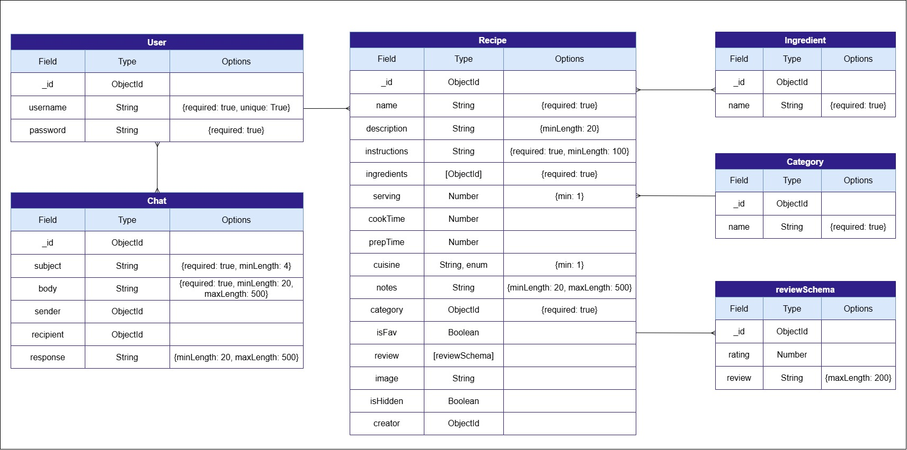

# 🥕Recipe Shelf🥩

## Overview
Recipe Shelf is your favourite website for finding meal inspiration every day. At Recipe Shelf, you'll discover a variety of recipes from different cuisines around the world. You can also share your favourite recipes with other chefs, allowing them to try and enjoy your creations. It's everything you need when you're not sure what to eat.

## Screenshots

### 🏠Home Page🍽️

## Technologies Used
1. HTML
2. CSS
3. JavaScript
4. Node.js
5. MongoDB

## Getting Started

- Deployment link
OR

git clone https://github.com/ZahraaTawfeeq/RecipeShelf
rm -rf .git
rm README.md

MONGODB_URI=your-mongo-db-connection-string
SESSION_SECRET=your-sectret-key
PORT=3000

npm i
## Installation

1. node seed.js 

2. nodemon server.js

## User Stories
**1.** Users can sign up, log in, and log out of the website.

**2.** Users can browse all recipes and view the details of each recipe.

**3.** Users can add, edit, delete, and hide their own recipes.

**4.** Users can save recipes to their favourites for future use.

**5.** Users can view their profile.

**6.** Users can leave ⭐ ratings and reviews after trying a recipe.

**7.** Users can delete their reviews.

**8.** Users can message recipe creators to ask questions about their recipes.

**9.** Users can search recipes by ingredient.

**10.** Users can filter by cuisine.

**11.** Users can filter recipes by category (e.g., Desserts, Main Courses, Appetizers, Drinks, etc.).

## Database Design

## Routes
### 🔒Auth🔑

| Method | Route | Description |
|---------|-------|-------------|
| GET | `/auth/sign-up` | Display sign up page |
| GET | `/auth/sign-in` | Display sign in page |
| GET | `/auth/sign-out` | Log out user |
| GET | `/auth/profile` | View user profile and their recipes |
| GET | `/auth/recipe-details/:id` | View recipe details |
| GET | `/` | Display home page with user and recipe counts |
| POST | `/auth/sign-up` | Create a new user account |
| POST | `/auth/sign-in` | Authenticate user login |

### 👩🏻‍🍳Index🍽️
| Method | Route | Description |
|---------|-------|-------------|
| GET | `/` | Display home page with user and recipe counts |

### 📖Recipes🍳

| Method | Route | Description |
|---------|-------|-------------|
| GET | `/recipes/all-recipes` | List all recipes |
| GET | `/recipes/new-recipe` | Display new recipe form |
| GET | `/recipes/recipe-details/:id` | View recipe details |
| GET | `/recipes/:id/edit` | Display edit recipe form |
| GET | `/recipes/filter` | Filter recipes by category, cuisine, or ingredient |
| GET | `/recipes/delete-confirm/:id` | Display delete confirmation page |
| POST | `/recipes/new` | Create a new recipe |
| POST | `/recipes/:id/fav` | Add recipe to favorites |
| POST | `/recipes/:id/unFav` | Remove recipe from favorites |
| POST | `/recipes/review/:id` | Add a review to a recipe |
| PUT | `/recipes/:id` | Update recipe |
| PUT | `/recipes/:id/hidden` | Hide or unhide recipe |
| DELETE | `/recipes/:id` | Delete recipe |
| DELETE | `/recipes/review/:recipeId/:reviewId` | Delete a recipe review |

### 💬Chat☕

| Method | Route | Description |
|--------|-------|-------------|
| GET | `/chat-window/:id` | Open chat page. |
| GET | `/chat-history` | View chat history. |
| GET | `/continue/:id` | Continue a chat. |
| POST | `/new` | Create a new chat. |
| POST | `/new-message` | Send a message. |

## Features
- **User Authentication:** Users can sign up, log in, and log out securely.

- **Browse Recipes:** View all recipes and explore detailed recipe pages.

- **Recipe Management:** Create, edit, and hide your own recipes.

- **Ingredient Search:** Search for ingredients while creating a new recipe.

- **Favourites:** Save recipes to your favourites for quick access later.

- **User Profiles:** View your personal profile and your shared recipes.

- **Ratings & Reviews:** Leave ⭐ ratings and reviews after trying a recipe.

- **Messaging:** Contact recipe creators to ask questions about their recipes.

- **Recipe Search:** Find recipes by searching for specific ingredients.

- **Filter by Rating:** Discover recipes based on their ratings.

- **Filter by Category:** Browse recipes by category, such as - Desserts, Main Courses, Appetizers, Drinks, and more.

## Future Enhancements

**1.** Responsive Design

## Credits
This website was developed by Zahraa.

For any recommendations or feedback, feel free to contact me via email.